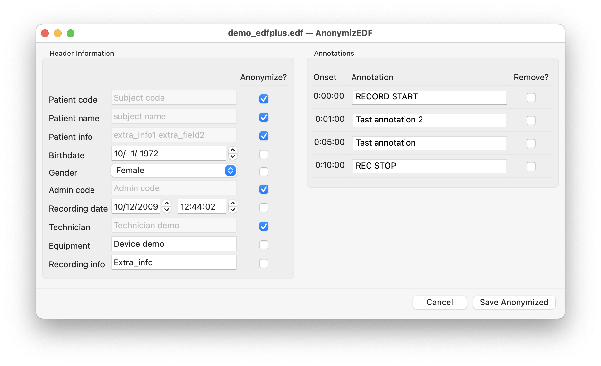

# AnonymizEDF

AnonymizEDF is a simple app to anonymize EEG recordings in EDF format, modifying header information and annotations.

## License

The code is released under the GPLv3 license (see `LICENSE` file).
